# Liam Hatakenaka Weekly Report
## Technology Design Foundations - Fall 2023

### Report 7 - Week of 10/12/2023

### _Reflections_

For the Breaking Language Barriers group, project 2 has been all about pivoting (so far). Given the somewhat vague project prompt we were given and our collective lack of experience with hardware and electronics, we had found it challenging to pin down an exact direction we wanted to take this project. After consulting with Shm, Sudhu, and TJ, we landed on a system that would replace the need for "safe words". 

"Safe words" are specially designated words that essentially mean, "I want to leave" or "I need saving" when in a social setting, most commonly at parties. We figured this would be a good domain to tackle, as currently there are no solutions out there for a discrete safe word non-verbal mode of communication. To us, we believe this is breaking language barriers because it allows people to communicate via a different medium. This is helpful and can even be life saving, as people who may feel unsafe in a situation at a party likely do not feel comfortable verbalizing their discomfort in front of whoever is making them feel unsafe, even if it is through coded langauge.

With this idea in mind, we began ideating on how we would pull this off. While many of our ideas were ambitious - utilizing the gesture sensor, the OLED screen, LEDs, a buzzer, and the button - Shm advised us we start off simple. We landed on a simple system utilizing two Photons, both with a button and a vibrating motor. These will be used to communicate with each other by simply pressing the button and buzzing the other motor. We will code the motors to have differing buzzing cadences to communicate different things as it relates to alerting someone with a safe word.

Here is a diagram of what our system might look like once all the parts are up and running:

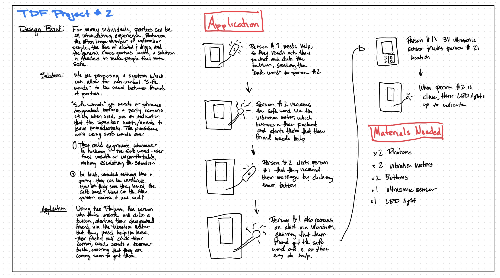

Now it was time to begin playing around with buzzers and sensors!

Since I have very little experience with microcontrollers, I started at the very ground level. Using the Photon, breadboard, and the vibration motor, I was able to get the motor buzzing:

However, this is just the first step, as I will need to connect the button and code it to control the buzzer. From there, I will need to focus on subscribing and getting two separate Photons to communicate with each other. 

To get there, I will first need to do a bit of soldering. I will need to solder the Sparkfun as well as the motor to the Haptic Motor Controller. Once I get these up and running, we should be well on our way to creating a system of non-verbal safe words!

### _Speculations_

As microcontrollers become more affordable and accessible (and electronics are taught more and more in K-12 education), it will be very interesting to see how their capabilities are applied to novel ideas that tackle real-world challenges. In just a few weeks, our group will hopefully have a working prototype of a device that allows safe words to be communicated non-verbally. I think that is very significant and important. I can only imagine all of the awesome applications of a cloud-capable microcontroller when it is put into the hands of young, diverse people - especially as AI grows more and more.

### Report 6 - Week of 10/5/2023

### _Reflections_

This week we were placed into our groups for - and slowly building up to the beginning of work for - project 2! I was assigned to the "breaking language barriers" group, which I am very excited about. Our general prompt/problem statement outlined how oftentimes, those travelling internationally feel embarrassed or at risk when they are openly trying to interpret or translate a foregin language - whether it be with a dictionary, phone, or headphones. We essentially are trying to find a solution to this, creating a device that will quickly, easily, and discretely translate languages for the adventurous tourist. 

At first, we narrowed our scope to that of the prompt. We were thinking almost solely within the bounds of a device that took in information via a microphone, used the Photon to translate, then relayed the translated words to the user via and OLED display or through headphones. This would be done by utilizing OpenAI's Whisper voice to text platform. 

However, we started to rethink the boundaries of our device. To allow for greater accessibility and discreteness, we started to consider ideas that were more wearable than our current device idea. After throwing around several ideas, we landed on a pair of sunglasses. Rather than just focusing on an audio-based device, we are hoping to integrate visual components as well, utilizing the OLED display we were given and an augmented reality component as well. We believe this will make for a more compact and discreet device, as well as increasing accessbility for poeple who are hard of hearing. 

Here are some initial product idea sketches via Vidit!

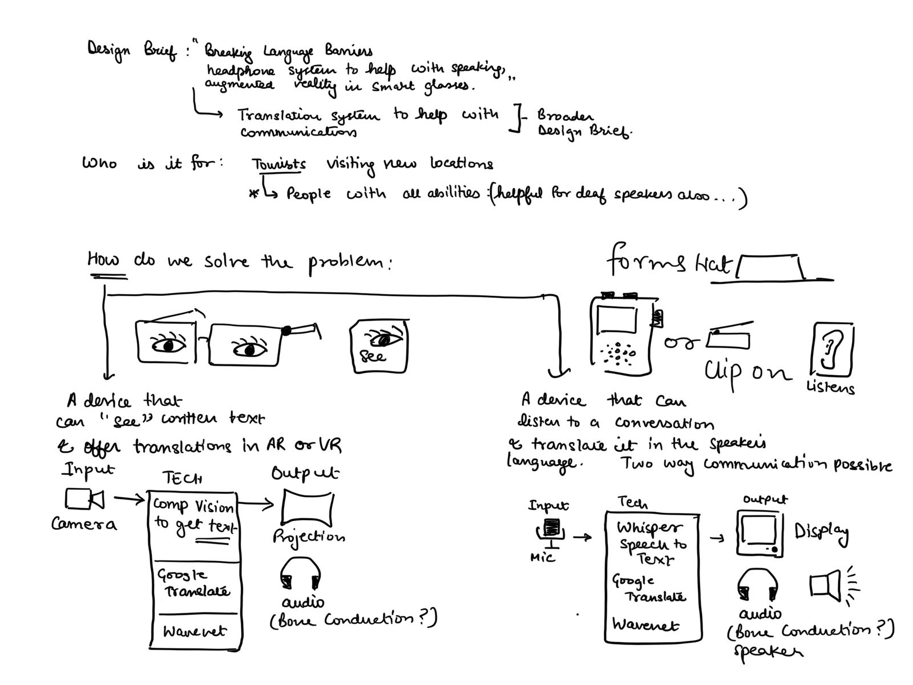

While most of us in our group have experience on the software/API side of things, none of us have very much expertise when it comes to hardware and electronics. Because of this, this project is equally exciting as it is daunting. We have already reached out to some of our cohortmates to use as consultants when we run into issues, and with the collective expertise of the TDF teaching staff, I am confident we will be able to bring our idea to life. 

### _Speculations_

I am really eager to see where all the individual teams decide to take their projects, and how the Photon will integrate with their specific challenges and constraints. Based on TJ's presentation on Monday, it seems that the Photon is super versatile in its applications. This versatility had both aided and slowed our process as a team. While there is a giant range of applications with it, that has also made it hard to narrow down our idea. While I am really excited with where our project is headed, we still need to scope it down, especially considering the timeline we are working with.

### Report 5 - Week of 9/28/2023

### _Reflections_

This week we have been slowly building up to project 2 and the directions in which we want to take it. I have been enjoying the pace at which we are familiarizing ourselves with the Photon before getting busy with its practical applications. Coming from a background where I rarely worked with hardware, I have appreciated the time to learn the very basics of what the Photon 2 is, how it works, and how we may apply it to our upcoming project.

Last Thursday, Sudhu walked us through steps 7-11 of the Photon 2 set up tutorial. This was a great experience and really helped me understand how to use the Photon and a breadboard better. 

First was hello World, which was the first bit of online code we used to test if our Photon was on and working. It worked! And i was met with an endless string of "hello World"'s in my debug log.

Next was blink, in which we commanded the Photon to blink the light located in the "D7" position. This was also relatively easy, given the code was readily avaiable.

After Blink, we connected our Photons to the bread board in order to try and blink an external LED. This took a bit more time for me than the previous tasks, as I had to understand where to connect each wire with respect to the positive and negative sides of each. Finally, I got it and ran the code and it lit up!

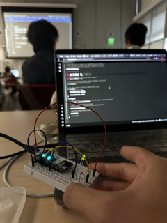

Then, we were challenged to make the LED and the D7 light alternate. This was also relatively easy with the given code, but it was still very satisfying to see the lights alternating. 

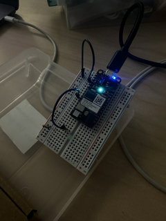

I went into the code and played around with the timing of the lights, making them alternate faster and slower to see how it would react.

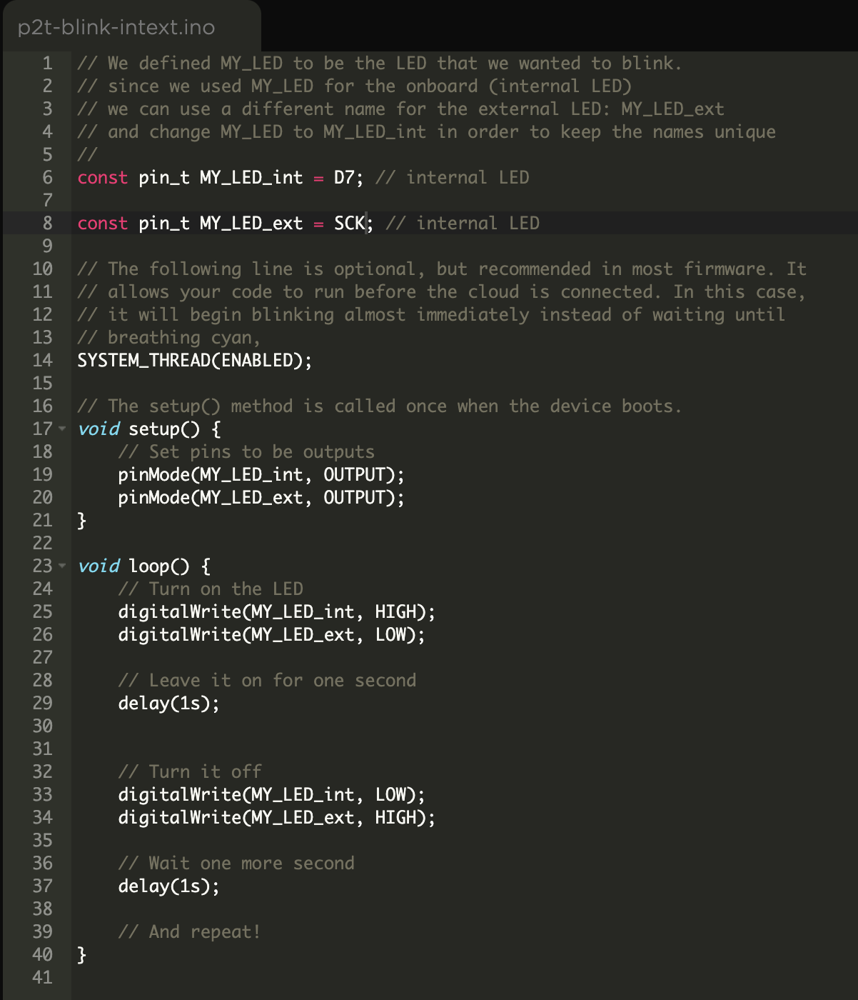

Lastly, we utilized an LDR (light dependent resistor) to create a sensor which would dictate the light's turning on and off. This was the coolest part of the day for me, as the Photon's abilities and practical applications started to become more clear and tangible. After attaching the sensor and opening the code, I changed a few things around, telling it to light up any time the values in the debug log exceeded 3000. 

What I got was an LED that would remain off under the normal light of the Jacobs 310 classroom...

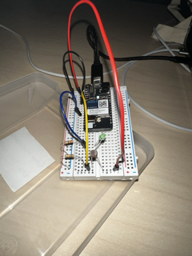

...then when I shined my phone flashlight at it and it exceeded 3000...

...it turned on!

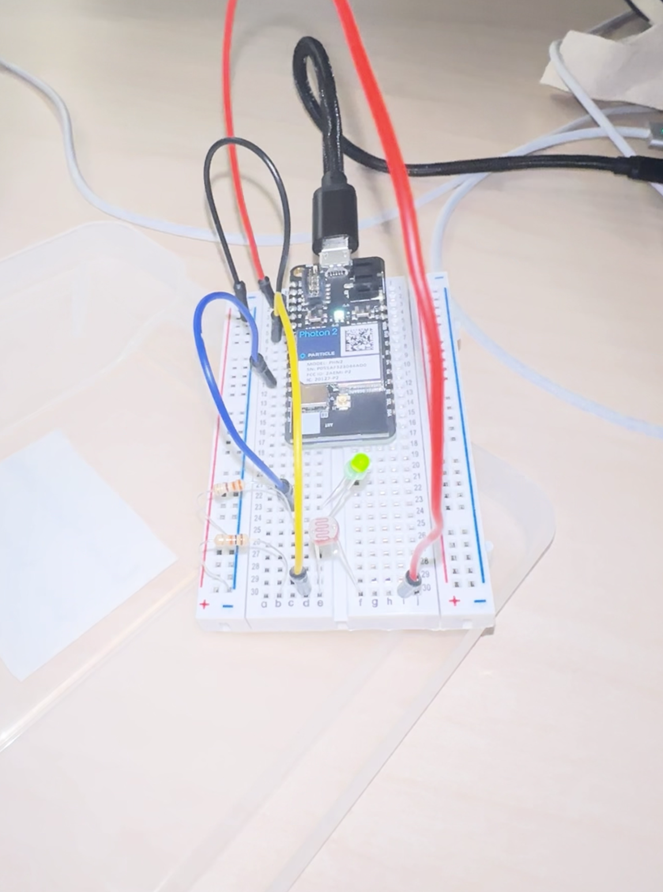

Overall, this was a great experience in getting my feet wet with the Photon 2 and its basic abilities.

### _Speculations_

While much of it went over my head, Adrian Freed's presentation on the intersection of electronics and fabrics was fascinating. I really enjoyed his stories about the summit that takes place every year in which people in his domain come together and share their ideas and work together, which allows them to stay years ahead of the general market at any given time. This is a really great example of the value of collaboration and selflessness in a team setting, something I hope our MDes cohort can continue to foster. It reminds me of the quote, "if you want to go fast, go alone. If you want to go far, go together."

As for how Adrian's talk can be applied to our upcoming project, I am very interested in how we could possibly incorporate sensors and electronics with fabrics. Like I said in my previous submission, I am very interested in how emerging technology can be applied to sport and personal health. The ability to incorporate cutting edge fabrics and technology can be invaluable to sport, as we have seen in companies like PULSEThrow and Catapult.

### Report 4 - Week of 9/21/2023

### _Reflections_

After a hectic week of computational design and spending way too much time staring at the Prusa, this week was a nice change of pace. This week was a great opportunity to slow down and play around, diving into project 2 and figuring out what the heck a Photon 2 is. But first, I was able to pick up my final phone stand on Monday and to my great relief, it had printed smoothly and was fully functional! Very nice start to the week.

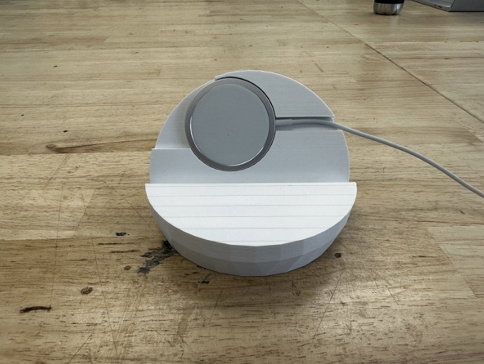

Now to the Photon. Sudhu kindly set up a very easy-to-follow tutorial on how to get the Photon up and running. But before I did that, I gave myself time to open up all the materials and look through them, sorting them into two groups: one being things I recognize and the other being things I don't. The daunting nature of this project and its included materials only increased when I was left with a pile about three times the size of the other: materials I don't recognize being the latter. 

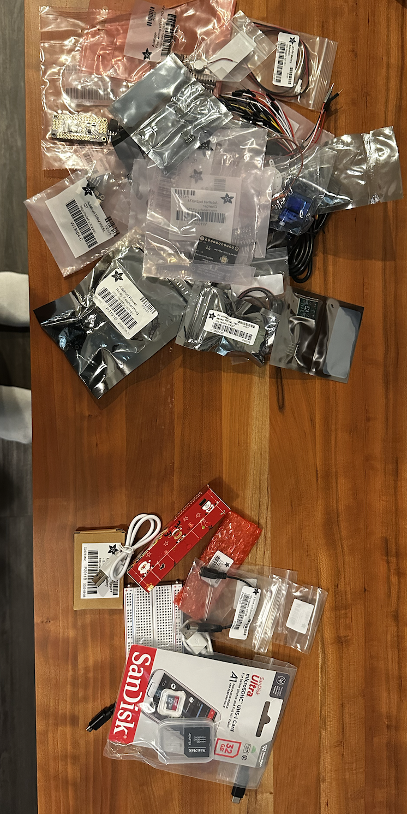

As I learned in the previous project however, this just means I have more to learn!

After organizing all of my materials, I jumped into the setting up tutorial. First, it was creating an account - something I'm familiar with! :D

After that, it was setting up the Photon2. Thankfully, Particle makes this a very easy process, as all that is needed is to plug in the device to your computer and they take the rest from there. 

Next was finding my device's MAC address. First, I went into GetMacAddress.ino and was met with the code necessary to copy the app

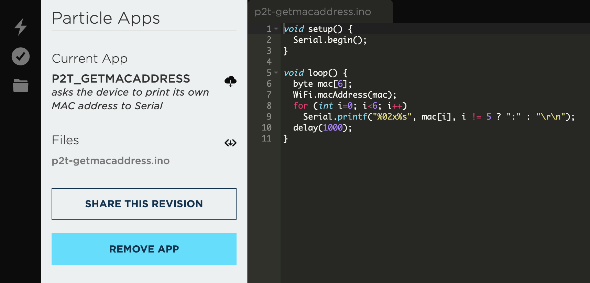

Then, I opened up the Particle USB serial debug log and found my MAC address!

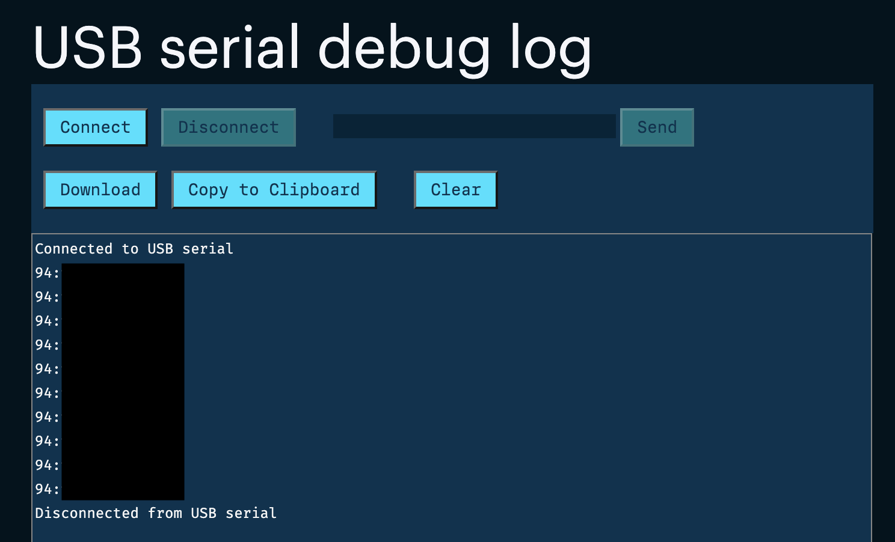

After that, I navigated to the Berkeley IoT website and registered my device

Now all I need to do is connect my device to Berkeley IoT wi-fi when I get to campus, easy stuff!

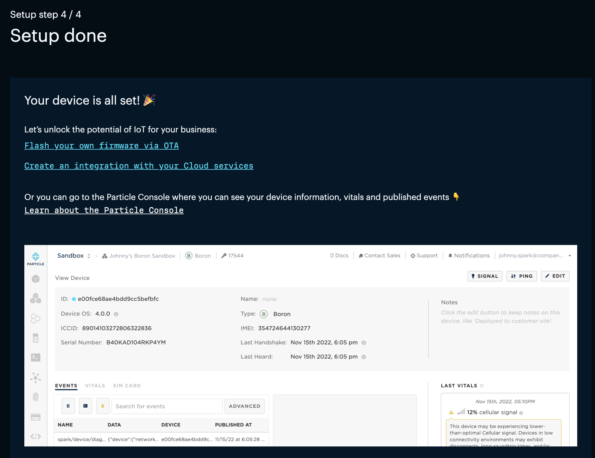

### _Speculations_

I am excited to do more research into what exactly the capabilites of this Photon 2 are. While I have worked with an Arduino once before, I still have very limited experience with hardware and electronics in general, so I am looking forward to getting more comfortable with them - hopefully to the point of being able to get creative with its applications. I have yet to do steps 7-10, but I was able to look ahead at some of the readings included like How to Use and Breadboard. Along with that, I read a great introductory article: _Particle's Photon 2: A Powerful Gateway to the IoT and Machine Learning World_, which outlines the Photon's machine learning applications. 

Based on what I read in the article, I am really excited to potentially explore the Photon's at-home IoT applications. Being that I'm interested in how design and technology intersect with personal health, fitness, and sport, I will be doing my exploration and research on how an IoT device can be applied to those domains.

### Report 3 - Week of 9/14/2023

### _Reflections_

This week I learned two main lessons: One, the best way to learn Grasshopper better (and almost anything for that matter) is to - as TJ always says - simply play around for a while. Two, I am far from feeling _comfortable_ in Grasshopper, but every moment spent working through problems and asking questions is a moment well spent. Coming off my first 3D print last week, I wanted to try and create a more "tailored" phone stand that would challenge my Grasshopper skills and provide me with a artifact that more closely fit my own needs. For this, I had to consider more situations in which I am in need of a phone stand. The use case I landed on is using my wireless charger while simultaneously watching YouTube. Typically, I only use my wireless charger overnight, as its flat geometry makes it awkward to use both landscape and portrait. However, I figured if I was able to make a charger-shaped recess in the back wall of the phone stand, it would not only prop my phone up, but also be able to charge my phone - thereby increasing the usability of my wireless charger. 

I started my process by making some rough sketches of what I envisioned this phone stand to look like. I had to consider several constraints, such as the angle at which I would want my phone placed, where the "charger hole" needed to be placed, and how I would account for the cable that connects to the charger itself.

I landed on a design that would embed the charger flat into the back wall of the phone stand while the phone lays in landscape mode - which would be great for needing to charge my phone while doing something like watching YouTube.

From here, I had to make my measurements. I again revisited my week one report, in which I laid out all of my phone measurements. For the charger, I was able to find [this](https://www.youtube.com/watch?v=1gxqxZlwCHI) YouTube video, which helped greatly because the creator used a much more precise measuring tool than I had access to. With my measurements in hand, I was not ready to open up Grasshopper and begin creating the phone stand. I was satisfied with the general geometry of the "CellPhoneStand_simple" file from last week, as it supported the phone well and felt sturdy as a whole. Because of this, I used this file as a template for what would become my personalized phone stand. 

Before I changed any of the geometry of the stand, I made what I saw to be the easiest changes first. Those changes were the ones that were already made easily available, like the phone width, the phone angle, and the orientation of the phone. After this, I reduced the radius of the inner sphere all the way to zero, which created a solid, flat back wall upon which I would add my charger geometry. Following this, I led myself down a long, inefficient path in order to achieve the recessed shape I desire. I would only find out just how inefficient my process was much later during office hours with Cody. Before that though, my initial process should be reflected on.

Much of my process was informed by TJ's YouTube video walking through the Grasshopper file, particularly the section in which he creates new geometry and utilizes the "sDiff" function. Unlike the video however, my challenge was not only creating new geometry to thereby use the "sDiff" function, but I had to move it around in space in order to align it with the back wall of the stand. 

This was something I had never really done and not only posed as the biggest challenge of this project, but also where my process could have been greatly improved. In short, the way in which I went about moving the cylinder was through several sets of "move" functions. While this (in essence) did what I wanted it to, there were a few big issues with it: first, it was wildly inefficient. 

To move the cylinder, I had to move it across the X, Y, and Z axes along with using the "3DRot" function to align it with the back wall. Secondly, it was imprecise. Rather than being able to algin the charger geometry with the exact angle of the back wall, I instead adjusted the angle of the shape by roughly half a degree until it looked to the naked eye to be aligned. While this may have "worked", this obviously is not best practice and was a good lesson learned. 

Once I had my cylinder in the position I wanted, I ran into the other big obstacle: using the "sDiff" function. When trying to use it, the cylinder simply would not be "cut into" the back wall of the phone stand. After hours of scouring the internet, consulting TJ's videos, and trying everything I could in Grasshopper, I finally realized my mistake: the "sDiff" function simply would not work unless the geometry to be "cut out" extended to both sides of the phone case.

While I was finally able to cut out the charger hole a new problem arose, the recess was way too deep for the phone to be able to charge and rest within the stand. To solve this, I had to add another cylinder which would act as a back rest, allowing the front of the charger to align with the back wall. To do this I again used far too many "move" commands and eyeballed the rotation in order to get it into place. 

After this, the last thing I needed to do was add a rectangle which would act as the hole for the charger's accompanying cable. This was the part of the design that I mocked the most iterations of in my sketches, having eventually settled on having it simply go off to the side. 

Finally, I was done and ready to print. Only once I brought my file to the Maker Space to be printed and had Cody look at my work did I learn how inefficiently I had made my phone stand. Cody walked me through the steps of how he would have done it, and it was much, much more intuitive. Rather than spamming the "move" function, he was able to move the charger recess onto the back wall of the stand in a few simple steps:

1. Used "DeBrep" to deconstruct the phone stand and find the back wall
2. Used "list" and a number slider to find the exact number that represented the back wall
3. Used "DePlane" and "Area" to be used with the "Orient" function which would orient the cylinder directly onto the back wall of the stand
From here, he simply used the "sDiff" function to create the recess, then repeating the same steps for the accompanying cable hole.

This ended up not only being a much more intuitive and efficient way of creating my phone stand, but it also eliminated the need for the inner cylinder support that my previous iteration had. This prevented my file from needing as many supports when 3D printing, which is especially helpful considering how small the hole was that I would have to get the supports out of. 

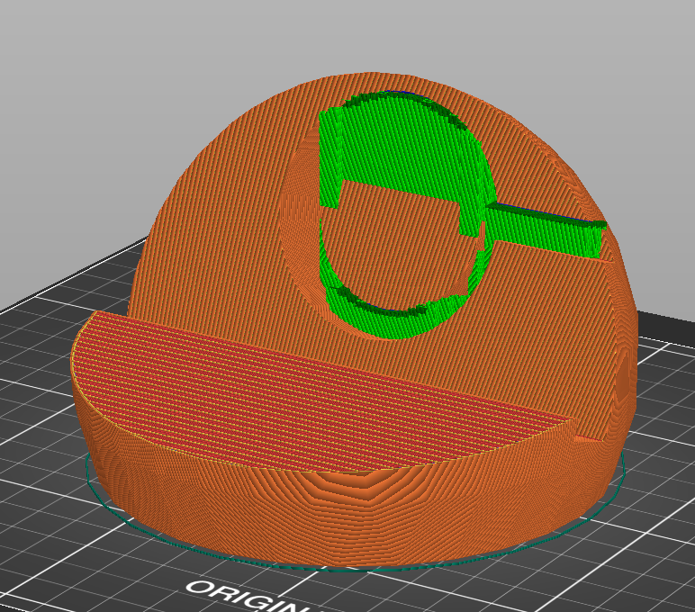

Now, all I had to do was print

UPDATE: the printer got jammed with with about an hour to go :( New print will be made and ready by Monday

LINK TO YOUTUBE VIDEO: https://youtu.be/0Dekjtj3TPI

_My three main takeaways this week are:_ 
1. Hofstadter's Law is undefeated
2. Cody is a wizard in Grasshopper
3. Playing around is key to learning

### _Speculations_

As I mentioned several times throughout this submission, I was helped out greatly by Cody and his knowledge of Grasshopper. The value of learning from someone with experience in something you are just starting cannot be overstated, however I wonder how this dynamic will hold up in the age of AI, especially as it pertains to programs like Grasshopper. While I did not utilize ChatGPT much, I am sure it would have helped at least a little bit. Would it have worked had I asked, "How can I make a more intuitive and efficient set of parameters to produce a phone stand that is compatible with an Apple MagSafe charger"? Likely not. But I can certainly see a world 5, 10, 15 years down the line in which LLMs are able to generate detailed instructions on how to do things like this. As it pertains to programs like Grasshopper, it will obviously make it much more accessible. However, people who hypothetically rely on AI to generate their parameters will miss out on crucial learning moments like I had all throughout the past week. In the way of "bespoke consumer goods" which I have written about the past two weeks, it could cause a boom in the market for them, as consumers could simply buy a template then ask ChatGPT how they can modify the parameters to their own liking.

### Report 2 - Week of 9/7/2023

### _Reflections_

This week I was really able to formally familiarize myself with Grasshopper. As I wrote about last week I had slightly misunderstood the assignment, doing the bulk of my work within Rhino itself and hardly using Grasshopper at all. While I was somewhat satisfied with the outcome of my phone stand, I wanted to better familiarize myself with Grasshopper. Of the four homework options, I chose to go with, "Bake the Grasshopper model to generate geometry which you can then modify to conform to your own aesthetic via modification." I felt this was the perfect level of challenge for me this week for several reasons:

1. I had not yet gotten comfortable with Grasshopper
2. I had never 3D printed on my own before this
3. While I had modified my previous phone stand to conform to my own aesthetic, it was done on the lasercutting version, rather than the 3D printed version

With this goal in mind, I started to consider how I wanted to modify the phone stand to fit my own needs. I reflected on all the times in which I had my phone propped up in the past week. Thanks to my handy phone wallet, I am able to prop it up horizontally, which I primarily use if I am watching a YouTube video. However, the case does not allow me to prop it up vertically. This is usually not a problem except for one scenario in particular: when I am on FaceTime. I find when I FaceTime my family or friends, I tend to prop my phone up vertically on something like a water bottle or book (especially when my hands are preoccupied during activities like eating). Because of this, I decided my phone stand would be configured to hold my phone vertically at and angle so as to allow me to FaceTime while sitting down at a table. Based on this use case, I had to make modifications of a few things:

- The size of the insert so as to fit my phone and case specifically
- The orientation of the phone from horizontal to vertical
- The angle at which the phone sits in the stand as I would instead be using it sitting down

With these in mind, I opened up Grasshopper and got to work. I was helped tremendously by [this](https://www.youtube.com/@paracourse/featured)  youtube channel that Ming suggested in the class slack channel. Once I had watched a few videos and done my fair share of playing around in Grasshopper, I felt comfortable enough with the UI to start making my modifications. Thanks to this weekly journal submission, the dimensions to my phone were easily accessible, making the modifications of them a very smooth process. From there, changing the viewing angle and the phone's orientation was even easier, as TJ had kindly made those functions easily accessible and understandable. 

All was going smoothly until it was time to bake and save the changes in Rhino. I mistakenly baked each individual change, rather than finding the '3D stand' brep. On top of that, the entire time I had been working in the 'CellPhoneStandModel00.gh' file, rather than the 'CellPhoneStand_forGrasshopper_all.3dm' file. These two mistakes meant that when I opened the Rhino file back up, I physically could not select the phone stand to be exported to STL. Rather, I could only click on the phone itself and its accompanying 'visual field' geometry. When exported to STL, this is what I was left with:

Not quite a phone stand...

After consulting Emily, Gia, and the session 2 lecture slides, I finally figured out how to properly open the '_all' Grasshopper and Rhino files. From there, I redid all my modifications, exported as an STL, and finally I was left with the proper, modified 3D phone stand.

Now that my file was ready for printing, I had to figure out how to print it. Like I mentioned earlier, I had no prior experience with 3D printing. I was told the Jacobs Printing Service website was the best place to get my print made, however the queues were quite long and I figured if I'm going to print something, I might as well learn how to do the printing. After consulting the Jacobs website and finding the instructions to the Prusa, I made a visit to the Maker Space. The set up of the file in the dedicated Prusa software was easy enough, and with the help of Cody I could finally get the printing underway.

After watching the first three layers be printed, I left the Maker Space anxious to see the final product eight hours later. Fast forward to the next day, and my print was done! Thankfully, it went very smoothly and my phone fits perfectly within it. Now I can forgo my makeshift water bottle stands when I am on FaceTime with friends or family :D

_My three main takeaways from this week are:_
1. Ask questions!
2. Make sure you know exactly what to bake in Grasshopper
3. Make sure you are working on the correct file before diving right in

### _Speculations_

Like I wrote about in the previous week, I am very interested to see where the idea of 'bespoke consumer goods' can go from here. Now having dabbled in Grasshopper this past week, I can see that the scope of these custom projects can be much, much larger, both literally and figuratively. This was reinforced after having a conversation with Cody, in which he explained how his preliminary work on creating an entire sports stadium was done in Grasshopper. I found this fascinating. As more and more people gets familiarized and comfortable with computational design softwares like Grasshopper/Rhino, what could the future of architecture look like? With the assistance of AI, could the work of architects be entirely replaced by people leveraging these programs? Maybe that is a bit extreme, but in a country like America where large contracting companies are building entire new suburban towns with redundant, McMansion-style designs, it is not hard to envision a future where this happens. I hope for the sake of architects, homeowners, and the world itself that this does not happen, but it is an interesting thought nonetheless.

### Report 1 - Week of 8/31/2023

### _Reflections_

Being that I had never used Rhino/Grasshopper before, when this phone stand project was introduced I was admittedly a bit indimidated. This intimidation only increased when I downloaded the files and was met with an interface that was equally confusing as it was overwhelming. For a good while I sat in front of my computer, not entirely sure what I was looking at, afraid to "mess up" the file I had opened. Thankfully, Kyle mentioned his Rhino tutorials (80 hours!) and directed me to the "Drafting 1" section, which familiarized me with the general UI of Rhino. 

From there, I was able to start playing around with the 'CellPhoneStand_DrawingsForProduction_2D.3dm" file. Being that I did the bulk of my work in Rhino over the weekend and Monday morning (before our second TDF class), I was not aware that the use of Grasshopper on some of the other provided files would aid me in manipulating the dimensions of my phonestand. Because of this, I had to really get familiar with how to manipulate objects. For this, Google really became my friend. At one point I had several tabs open, all reading something like, "how to measure length of a line in Rhino", "how to measure angles in Rhino", and "how to insert control points in Rhino". Other than the use of the command line (which came in very handy), many of the gestures I made were surprisingly similar to those I have done in programs like Illustrator and Figma.

Since I did not make many edits to the overall dimensions of the cutout in the phone stand, I instead decided to change the _shape_ of it. Being that I have a case and a stick-on wallet on the back of my phone, I felt that making a stand which would accomodate the shape of those would be a good challenge. I started by measuring the dimensions of my phone in different areas, seeing how the depth of it differed on the "wallet end" as opposed to the "camera end".

 

From there, I went into Rhino and began working on the individual pieces, constantly using the "distance", "insert control points", and "angle" commands to make sure I got it just right. 

Finally, I was ready to export the file to illustrator and get it ready for laser cutting. Some troubleshooting was necessary here, as on my first few attempts all that was exported was a single line from the Rhino file. The solution was to select and export each of the four individual pieces into separate Illustrator files, then combine them into a single one. All that was left was to delete one of the original lines that served as the back support of the phone stand, which I found much easier to do in Illustrator than in Rhino: simply adding in control points at the corners then deleting the segment between them.

 

Now it was time to laser cut. While I had used a laser cutter plenty of times during undergrad, I had to familiarize myself with the software and lasercutter itself that is found in the Jacobs Maker Space. For this I had to call in Cody, who was extremely helpful in both the set up and the execution of the cut. To my surprise, the initial cut did not penetrate all the way through my piece of wood, so I had to run the cut several more times before I was able to pop each piece out. Unfortunately, the scrap piece of wood I used was a much smaller thickness than the Rhino file has accounted for. While the stand still does come together, it is [a bit loose](phone_stand_photo5.HEIC) at the base. Had I known this would happen, I would have made the insert holes much smaller, making for tighter tolerances. (I forgot to take photos during the laser cutting process :()

Despite the aforementioned looseness of the pieces, I am overall satisfied with how my phone stand came together in terms of how it is shaped around my phone wallet and camera. Had I done this over, I would have changed a few things. For one, I would have make the insert holes smaller as i mentioned before (or just used a thicker piece of wood). Secondly, I would have first worked in Grasshopper (which I now am more familiar with thanks to TJ's demonstration) and changed the angle at which the phone lays in the stand. In its current state, I think my stand puts the phone at too vertical of an angle for it to be very usable at close distances. 

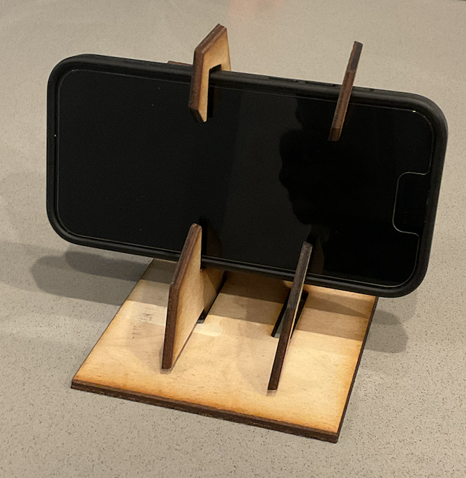

_My three main takeaways from this project are_:
1. Just start! Don't let the unfamiliarity of the UI or the blank document stop you from simply playing around and getting started.
2. Google/ChatGPT are your friends. These came in very handy when trying to find commands that would help in my process.
3. Be cognizant of the material thickness you are laser cutting on with respect to the file you worked on.

### _Spectulations_ 

As technology like laser cutters and 3D printers become cheaper and a more viable option for regular consumers, it will be really interesting to see if these "bespoke products" start popping up. I could definitely see a world in which companies - rather than selling a product itself - instead sell files of their products, fit with instructions for the customer on how to tailor the file specifically to their own needs. I believe this is already a regular practice on sites like Etsy, where small businesses sell templates for clothing items that customers can buy and cut and sew on their own. Not only does this ensure products will be fit even better for individual customers, I believe it will deepen customers' relationships with the products they buy. When they take the time to tailor their goods specifically to themselves, it adds a layer of effort and care that they otherwise would not have for, say, a phone stand they buy on Amazon. Because of this, I think this model can also help cut down on waste. Rather than buying goods that, at the moment, may be just "good enough" for customers, they will purchase goods that are made specifically for them, reducing the likelihood that they will replace that item with something slightly better down the line. 

